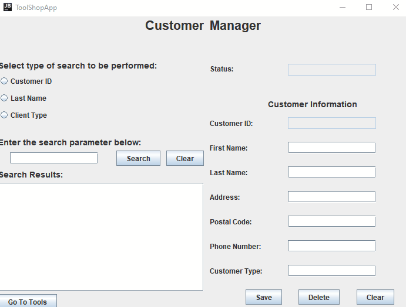

# ENSF607_TermProject

## About
This project is the combined final between ENSF607 and ENSF608. We were tasked with designing and implementing a 
distributed inventory and client management system using MVC design pattern, Java, MySQL, and JDBC. 
Client and Server architecture implemented and are running locally, communicating over sockets.

## Project Objectives
1. Conceptual database design based on a narrative
2. Logical database design through relational model mapping
3. Implementation and querying of a database
4. Java Graphical User Interface Event-Handling
5. Client-Server Architecture
6. Working with a database through a Java program
7. MVC

## Requirements
- Java 11
- MySQL Workbench
- JDBC

## Program Demo

## Running the Program
To run this program, follow these steps:

1. Clone the repository
2. Open and run "toolShopDB.sql" located in "ENSF607_TermProject/DBFiles/" in MySQL workbench
3. Import the csv files to their respective tables to populate the database (customers.csv --> customer table in MySQL)
4. Populate the required database credentials in DBCredentials.java located in "src/Server/Controller/DBController/DBCredentials.java"
5. Run Server.java located in "src/Server/Controller/ServerController/Server.java" to run the local server
6. Run ClientController.java located in "src/Client/Controller/ClientController/ClientController.java" to launch the GUI
7. Use the GUI to perform actions on the database! You can run multiple clients since the server utilizes a thread pool
